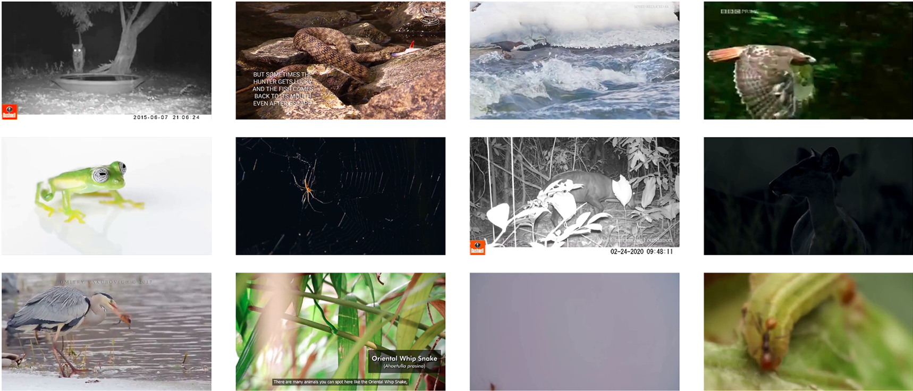
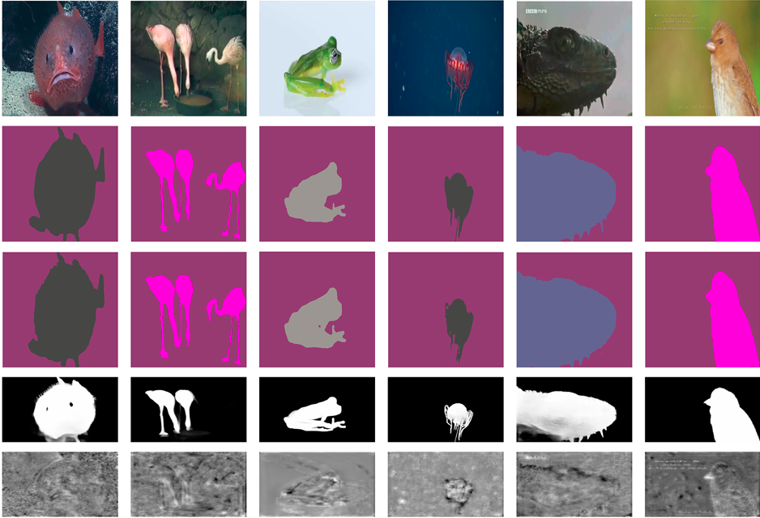

# WildAnimal650+: A Large-Scale Annotated Dataset for Generalized Animal Segmentation in Unconstrained Environments

<p align="center">
  
</p>

## Overview

WildAnimal650+ is a large-scale, ecologically grounded semantic segmentation dataset designed for open-world animal understanding in unconstrained environments.

The dataset contains:

- 10,032 high-resolution images
- 658 animal species
- Pixel-level semantic segmentation masks
- Six ecologically meaningful supercategories:
  - Amphibians
  - Birds
  - Fish
  - Insects
  - Mammals
  - Reptiles

WildAnimal650+ captures challenging real-world conditions including:

- Day/night illumination
- Occlusions
- Camouflage
- Motion blur
- Dense vegetation
- Adverse weather conditions
- Complex natural backgrounds

This dataset is designed to benchmark robust segmentation systems for ecological AI, biodiversity monitoring, conservation science, and open-world perception.

---

# Dataset Highlights

- Largest ecologically grounded animal segmentation dataset
- Fine-grained species-level annotations
- COCO-format pixel-wise masks
- Real-world ecological variability
- Open-world segmentation benchmark
- Hierarchical taxonomic structure

---

# Dataset Statistics

| Property | Value |
|---|---|
| Images | 10,032 |
| Species | 658 |
| Supercategories | 6 |
| Annotation Type | Pixel-wise segmentation |
| Annotation Format | COCO |
| Environment | Unconstrained natural scenes |

---

# Supercategories

| Supercategory | Species Count |
|---|---|
| Amphibians | 36 |
| Birds | 168 |
| Fish | 81 |
| Insects | 136 |
| Mammals | 125 |
| Reptiles | 112 |

---

# Benchmark Models

We benchmark the following segmentation architectures:

- DeepLabV3+
- PSPNet
- UNet++
- SegFormer

Our experiments demonstrate significant performance degradation under ecological distribution shifts and challenging environmental conditions.

---

# Sample Visualizations

## Ecological Diversity

<p align="center">
  
</p>

## Segmentation Examples

<p align="center">
  
</p>

---

# Dataset Structure

```text
WildAnimal650Plus/
│
├── images/
├── annotations/
├── train/
├── val/
├── test/
├── assets/
├── scripts/
└── benchmarks/
```

---

# Annotation Protocol

Annotations were generated using:

- Segment Anything Model (SAM)
- CVAT refinement workflow
- Multi-stage quality control

All masks follow the COCO instance segmentation specification.

---

# Applications

WildAnimal650+ enables research in:

- Ecological AI
- Biodiversity monitoring
- Wildlife segmentation
- Open-world perception
- Species recognition
- Habitat understanding
- Conservation-oriented vision systems

---

# Citation

If you use WildAnimal650+ in your research, please cite:

```bibtex
@article{yamouni2026wildanimal650,
  title={WildAnimal650+: A Large-Scale Annotated Dataset for Generalized Animal Segmentation in Unconstrained Environments},
  author={Yamouni, Rima},
  journal={},
  year={2026}
}
```

---

# License

This dataset is released for academic and research purposes only.

---

# Project Page

Coming soon.

---

# Contact

Rima Yamouni

For questions or collaborations, please open an issue on this repository.
